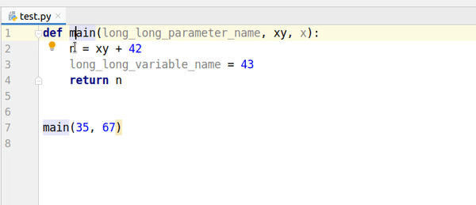

# PythonTypeAnnotationPlugin

This plugin suggests adding `: int` annotation when `Alt+Enter` is pressed.

## Run

1. clone this project
2. run `./gradlew runIde`
3. when PyCharm started try to press `Alt + Enter` in any file near parameter or local variable assignment without annotation

Tested only with JDK8.

